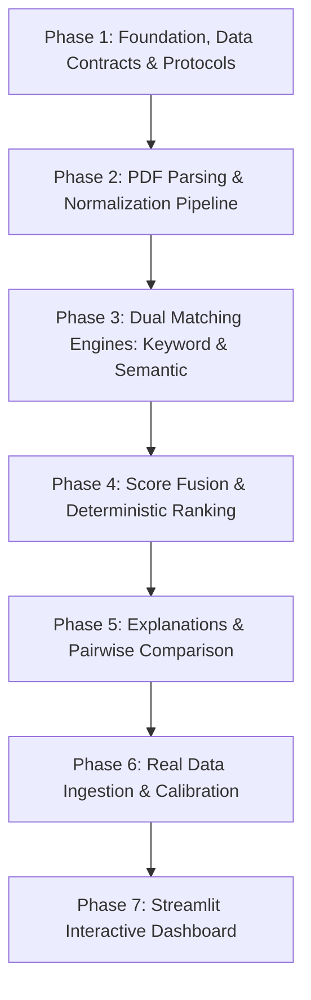

# Implementation Plan — Nexora: Smart Shortlisting Engine

Build the **Smart Shortlisting Engine** for the **InternLoom AI Hackathon** to evaluate and rank 15–18 candidate resumes against a single Job Description (JD) PDF.

The engine uses an approved dual-signal architecture combining genuine keyword matching and local sentence-transformer semantic matching, fused deterministically, with evidence-backed explanations and pairwise candidate comparisons.

> [!IMPORTANT]
> **Data Availability & Constraints:**
> - The actual Job Description PDF and 15–18 resume PDFs have **not** yet been provided.
> - We do **not** fabricate sample documents or hardcode assumptions based on imaginary resume content.
> - All initial tests use synthetic, inline programmatic fixtures.
> - As instructed, this plan stops **before** implementing application logic, pending your approval.

---

## User Review Required

> [!NOTE]
> Please review the proposed phase structure and data contract design. Once approved, Phase 1 (Foundation, Data Contracts, Interfaces, and Synthetic Unit Tests) will begin.

Key Architectural Safeguards Confirmed:
1. **No LLM Score Delegation**: Ranking is derived from deterministic math:
   $$\text{Final Score} = 0.35 \times S_{\text{req}} + 0.35 \times S_{\text{semantic}} + 0.20 \times S_{\text{lexical}} + 0.10 \times S_{\text{pref}}$$
2. **Dual Signal Materiality**: Both keyword/lexical and semantic signals will independently and materially impact candidate ranks.
3. **Deterministic Explanations**: Zero hallucinated skills or evidence; Top 3 explanations and pairwise comparisons ("Why did Candidate X beat Candidate Y?") will be constructed purely from stored evaluation records.
4. **Lean Stack**: No databases, no auth, no microservices, no multi-JD complexity.

---

## Proposed Phases



---

### Phase 1: Project Foundation, Data Contracts & Protocols (Immediate)
Establish project dependencies, clean Python module structure, Pydantic domain models, abstract protocols, and synthetic unit test fixtures.

#### [NEW] [requirements.txt](file:///c:/Users/yadav/OneDrive/Desktop/nexora/requirements.txt)
Define pinned dependencies:
- `pymupdf` (PDF text extraction)
- `sentence-transformers` & `torch` (local embedding inference: `all-MiniLM-L6-v2`)
- `scikit-learn` (cosine similarity)
- `rapidfuzz` (fuzzy string matching)
- `pydantic>=2.0` (strict data validation)
- `streamlit` (UI)
- `pytest` (test harness)

#### [NEW] [src/config.py](file:///c:/Users/yadav/OneDrive/Desktop/nexora/src/config.py)
Configuration settings class:
- Fusion weights: `required_skill=0.35`, `semantic=0.35`, `lexical=0.20`, `preferred_skill=0.10`
- Embedding model: `all-MiniLM-L6-v2`
- Thresholds: semantic similarity cutoffs (`exact >= 0.85`, `related >= 0.70`, `inferred >= 0.55`), rapidfuzz ratio threshold (`>= 85.0`)
- Section weights: Experience (`1.2`), Projects (`1.0`), Skills (`0.8`), Education (`0.6`)

#### [NEW] [src/models/schemas.py](file:///c:/Users/yadav/OneDrive/Desktop/nexora/src/models/schemas.py)
Pydantic data models:
- `EvidenceChunk`: `id`, `text`, `section` (e.g. Experience, Skills), `page_number`, `confidence`
- `JobDescription`: `id`, `title`, `raw_text`, `required_skills` (list of canonical skill names), `preferred_skills`, `responsibilities`, `requirement_chunks` (list of `EvidenceChunk`)
- `CandidateResume`: `id`, `name`, `email`, `raw_text`, `sections` (dict of section name to text), `normalized_skills` (list of str), `evidence_chunks` (list of `EvidenceChunk`)
- `KeywordMatchResult`: `matched_skills`, `missing_required_skills`, `missing_preferred_skills`, `evidence_map`, `raw_lexical_score`
- `SemanticMatchResult`: `requirement_matches` (mapping each requirement to top evidence chunk + similarity score + match tier), `raw_semantic_score`
- `ScoreStructure`: `required_skill_coverage`, `semantic_requirement_alignment`, `contextual_lexical_relevance`, `preferred_skill_coverage`, `final_score`
- `EvaluationRecord`: `candidate_id`, `candidate_name`, `scores` (`ScoreStructure`), `matched_required`, `matched_preferred`, `missing_required`, `semantic_matches`, `keyword_matches`, `evidence`, `rank`
- `PairwiseComparison`: `candidate_a_id`, `candidate_b_id`, `winner_id`, `score_delta`, `required_skill_delta`, `semantic_evidence_diff`, `explanation`

#### [NEW] [src/interfaces/protocols.py](file:///c:/Users/yadav/OneDrive/Desktop/nexora/src/interfaces/protocols.py)
Protocol definitions:
- `BaseParser`: `parse_jd(pdf_path: Path) -> JobDescription`, `parse_resume(pdf_path: Path) -> CandidateResume`
- `BaseKeywordEngine`: `match(candidate: CandidateResume, jd: JobDescription) -> KeywordMatchResult`
- `BaseSemanticEngine`: `match(candidate: CandidateResume, jd: JobDescription) -> SemanticMatchResult`
- `BaseScorer`: `calculate_score(...) -> ScoreBreakdown`, `rank_candidates(...) -> List[EvaluationRecord]`
- `BaseExplainer`: `generate_top_explanations(...) -> Dict[str, str]`, `compare_pair(...) -> PairwiseComparison`

#### [NEW] [tests/test_models.py](file:///c:/Users/yadav/OneDrive/Desktop/nexora/tests/test_models.py)
Unit tests for Pydantic schemas validation and serialization with synthetic fixtures.

---

### Phase 2: PDF Parsing & Text Normalization Pipeline
Implement text extraction and section segmentation.
- [NEW] `src/parsers/pdf_parser.py`: PyMuPDF text & page extractor.
- [NEW] `src/parsers/section_segmenter.py`: Regex & header heuristics for dividing resumes into Experience, Education, Skills, Projects.
- [NEW] `src/parsers/normalizer.py`: Standardizes casing, whitespace, and resolves canonical skill aliases (`k8s` -> `kubernetes`, `react.js` -> `react`, `postgres` -> `postgresql`).
- [NEW] `src/parsers/chunker.py`: Extracts bullet points and coherent sentences with section tags.
- [NEW] `tests/test_parsers.py`: In-memory synthetic text tests.

---

### Phase 3: Dual Matching Engines
- [NEW] `src/engines/keyword_engine.py`:
  - Exact skill matching
  - Conservative aliases & phrase matching
  - `rapidfuzz` token-set ratio matching with strict boundary
  - Section-aware evidence weighting & duplicate mention suppression
- [NEW] `src/engines/semantic_engine.py`:
  - Local `all-MiniLM-L6-v2` encoder
  - Pairwise cosine similarity between requirement chunks and candidate evidence chunks
  - Best-evidence extraction per requirement
  - Thresholding & tier classification (Exact, Related, Inferred)
- [NEW] `tests/test_engines.py`: Tests verifying both engines run independently and produce distinct numeric signals.

---

### Phase 4: Deterministic Score Fusion & Ranking Engine
- [NEW] `src/scoring/fusion.py`:
  - Implementation of $0.35 \times S_{\text{req}} + 0.35 \times S_{\text{semantic}} + 0.20 \times S_{\text{lexical}} + 0.10 \times S_{\text{pref}}$
- [NEW] `src/scoring/ranking.py`:
  - Sorts candidates descending by final score
  - Deterministic tie-breaking rules (required skill coverage, then semantic score)
  - Produces complete `EvaluationRecord` objects
- [NEW] `tests/test_scoring.py`: Mathematical precision and tie-breaking tests.

---

### Phase 5: Deterministic Explanations & Pairwise Comparator
- [NEW] `src/explanation/explainer.py`:
  - Top 3 candidate template-based explanations citing exact evidence quotes.
  - Clear itemization of matched skills and missing required skills.
  - Zero hallucination guarantees (only references verified extracted data).
- [NEW] `src/explanation/pairwise.py`:
  - "Why did Candidate X rank above Candidate Y?" comparator.
  - Evaluates differences in required skill coverage, component scores, and semantic evidence strength.
- [NEW] `tests/test_explanation.py`: Verification that explanations accurately reflect underlying records.

---

### Phase 6: Real Data Ingestion & Batch Pipeline (When Real PDFs Arrive)
- [NEW] `src/pipeline.py`: Batch evaluation script running the 1 JD PDF + 15–18 Resume PDFs from `data/`.
- [NEW] `outputs/`: Generates structured `evaluation_results.json` and human-readable `ranking_report.md`.
- Inspection of real extraction results, failure cases, and calibration of thresholds.

---

### Phase 7: Interactive Streamlit Dashboard
- [NEW] `app/app.py`:
  - Leaderboard view with score breakdown bars.
  - Candidate detail cards with matched/missing skills and evidence quotes.
  - Interactive "Compare Candidates" pairwise differential dropdown.

---

## Verification Plan

### Automated Tests
```powershell
pytest -v tests/test_models.py
pytest -v tests/test_interfaces.py
pytest -v tests/test_scoring.py
pytest -v tests/test_engines.py
pytest -v tests/test_explanation.py
```
- Validate Pydantic models against synthetic input.
- Validate scoring mathematical accuracy against manual calculations.
- Validate that changing keyword score changes final ranking (signal materiality test).
- Validate that changing semantic score changes final ranking (signal materiality test).
- Validate pairwise comparator determinism on synthetic candidate pairs.

### Manual Verification
- Verify that `requirements.txt` installs cleanly in the Python environment.
- Run synthetic smoke test end-to-end through interfaces.
